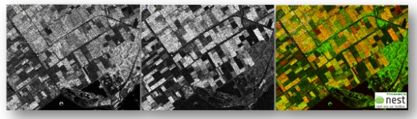

# SAR to Optical RGB

<b>Status: In Progess</b>
<ul>
  <li>Using Pix2Pix for converting SAR satellite images to RGB colored images.</li>
  <li>SAR images collected from Sentinel 2 and RGB from Sentinel 1.</li>
  <li>Dataset is prepared from Google Earth Engine.</li>
</ul>
